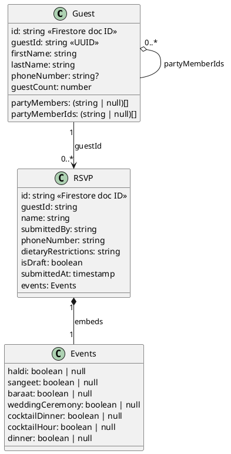

# RSVP Data Model

## Entity Relationship Diagram

## Collections (Firestore)

### `guests`
One document per named guest.

- `guestId`: UUID generated at creation time. Used as the stable foreign key across collections (distinct from the Firestore document ID).
- `guestCount`: total party size including self (e.g. `3` = this person + 2 others).
- `partyMembers`: fixed-size array of length `guestCount - 1`, indexed by position. Each slot is a lowercase full-name string or `null` if not yet provided. Written back by index on every save/submit so renames apply in-place without drift.
- `partyMemberIds`: parallel array of `guestId` values for each party member slot. `null` until the member's guest doc is created (which happens when they enter their name during RSVP).
- `phoneNumber`: optional. Only set for primary invitees; used to disambiguate when multiple guests share the same name.

### `rsvps`
One document per person (one per party member, including the party head).

- `guestId`: references `guests.guestId` — the stable key linking an RSVP to its guest doc.
- `name`: lowercase full name of this party member.
- `submittedBy`: lowercase full name of the party head who filled out the form.
- `phoneNumber`: formatted phone number of the party head (e.g. `+1 6045551234`).
- `dietaryRestrictions`: free-text dietary notes, empty string if none.
- `isDraft`: `true` when the guest closed mid-flow and their progress was auto-saved; `false` on final submission.
- `events`: flat map of event key → `true`/`false`/`null`. `null` means unanswered (only valid on drafts).

## Key Relations

1. `guests.guestId` is the stable foreign key — the Firestore doc ID is not used for cross-collection references.
2. `guests.partyMembers[i]` holds the name for party slot `i+1` (slot 0 is the guest themselves). `null` means the slot is unfilled.
3. `guests.partyMemberIds[i]` is the `guestId` of the guest doc for slot `i+1`. `null` until the member enters their name during RSVP, at which point their guest doc is upserted and this slot is written back.
4. Each `rsvp.guestId` corresponds to `guests.guestId` for that individual (primary or party member).
5. `rsvp.submittedBy` is the party head who submitted the form, not necessarily the RSVP subject.
6. Draft RSVPs (`isDraft: true`) are created when a guest closes mid-flow. On return, the form resumes from saved state. Final submission sets `isDraft: false`.
7. Event values are `boolean | null` — `null` is only valid in draft state; final RSVPs must have `true` or `false` for every event.

## Events

| Key | Label | Date |
|-----|-------|------|
| `haldi` | Ganesh Pooja & Haldi | June 3 — Thursday |
| `sangeet` | Sangeet | June 3 — Thursday |
| `baraat` | Baraat | June 4 — Friday |
| `weddingCeremony` | Wedding Ceremony | June 4 — Friday |
| `cocktailDinner` | Cocktail & Dinner | June 4 — Friday |
| `cocktailHour` | Cocktail Hour | June 5 — Saturday |
| `dinner` | Dinner | June 5 — Saturday |
