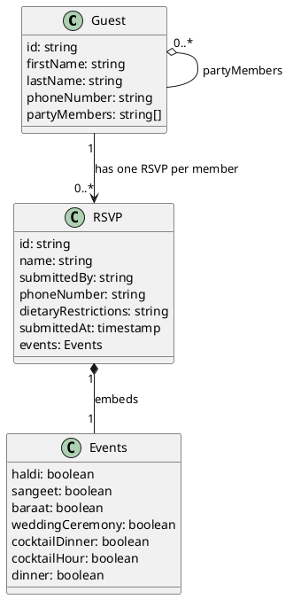

# RSVP Data Model

## Entity Relationship Diagram

## Collections (Firestore)

### `guests`
One document per named guest. `partyMembers` is an array of lowercase full-name strings referencing other guests in the same party.

### `rsvps`
One document per person, keyed by `name` (lowercase full name). `events` is a map of event keys → `true/false`. `submittedBy` is the party head who filled out the form.

## Key Relations

1. A `guest` document's `partyMembers[]` array lists other `rsvp` names in the same group.
2. Each `rsvp.name` corresponds to a member from that guest's party (including the guest themselves).
3. `rsvp.submittedBy` points back to the lookup guest (the person who filled out the form).
4. `rsvp.events` is a flat map — one boolean per event key — not a subcollection.

## Events

| Key | Label | Date |
|-----|-------|------|
| `haldi` | Ganesh Pooja & Haldi | June 3 — Thursday |
| `sangeet` | Sangeet | June 3 — Thursday |
| `baraat` | Baraat | June 4 — Friday |
| `weddingCeremony` | Wedding Ceremony | June 4 — Friday |
| `cocktailDinner` | Cocktail & Dinner | June 4 — Friday |
| `cocktailHour` | Cocktail Hour | June 5 — Saturday |
| `dinner` | Dinner | June 5 — Saturday |
