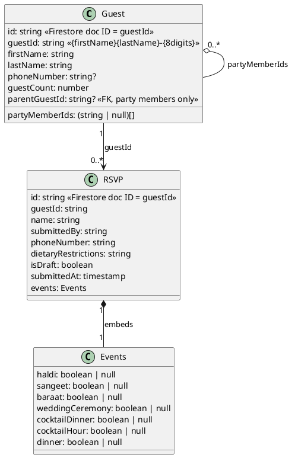

# RSVP Data Model

## Entity Relationship Diagram

## Collections (Firestore)

### `guests`

One document per named guest. **Firestore doc ID = `guestId`.**

- `guestId`: deterministic ID in the form `{firstName}{lastName}-{8digits}` (e.g. `johnsmith-04829173`). Derived via SHA-256 of `wedding2026_{slug}_{parentGuestId}` — same inputs always produce the same ID. Used as both the Firestore doc ID and the stable foreign key across collections.
- `guestCount`: total party size including self (e.g. `3` = this person + 2 others).
- `partyMemberIds`: array of `guestId` values for each party member slot, length = `guestCount - 1`. `null` for unfilled slots. Names are resolved by fetching the referenced guest docs via `lookupNamesByGuestIds` — there is no redundant `partyMembers` name array.
- `parentGuestId`: present on party member docs only. The `guestId` of the primary guest this member belongs to. Scopes member lookups so two guests named "John Smith" in different parties don't collide. Absent on primary guest docs.
- `phoneNumber`: optional. Only set for primary invitees; used to disambiguate when multiple guests share the same name.

### `rsvps`

One document per person (one per party member, including the party head). **Firestore doc ID = `guestId`.**

- `guestId`: matches `guests.guestId` and the Firestore doc ID — `saveRsvps` always writes via `setDoc(doc(db, "rsvps", guestId))`, no separate ID tracking needed.
- `name`: lowercase full name of this party member. Corrected automatically if the party head fixes a misspelling — `saveRsvps` overwrites the full doc on every save/submit.
- `submittedBy`: lowercase full name of the party head who filled out the form.
- `phoneNumber`: formatted phone number of the party head (e.g. `+1 6045551234`). Empty string if not provided.
- `dietaryRestrictions`: free-text dietary notes, empty string if none.
- `isDraft`: `true` when the guest closed mid-flow and their progress was auto-saved; `false` on final submission.
- `events`: flat map of event key → `true`/`false`/`null`. `null` means unanswered (only valid on drafts).

## Key Relations

1. **Doc ID = guestId** in both `guests` and `rsvps` collections — no separate auto-generated Firestore IDs.
2. `guestId` format is `{firstName}{lastName}-{8digits}`, derived deterministically via SHA-256. The suffix is stable even if the name is later corrected via `updateGuestMemberName` (the doc ID stays the same; only `firstName`/`lastName` fields are patched).
3. `guests.partyMemberIds[i]` is the `guestId` of the guest doc for slot `i+1` (slot 0 is the guest themselves). `null` means the slot is unfilled.
4. Each `rsvp.guestId` corresponds to `guests.guestId` for that individual (primary or party member).
5. `rsvp.submittedBy` is the party head who submitted the form, not necessarily the RSVP subject.
6. Draft RSVPs (`isDraft: true`) are created when a guest closes mid-flow. On return, the form resumes from saved state. Final submission sets `isDraft: false`.
7. Event values are `boolean | null` — `null` is only valid in draft state; final RSVPs must have `true` or `false` for every event.
8. `guests.parentGuestId` links a party member doc back to its primary guest. Member lookups in `upsertGuestForMember` are scoped by `firstName + lastName + parentGuestId`, preventing cross-party name collisions. Primary guest docs have no `parentGuestId`.

## Name Correction Flow

If a party head misspells a member's name and later corrects it:

1. `persistGuestData` detects the slot already has a `guestId` and calls `updateGuestMemberName` — patches `firstName`/`lastName` on the guest doc in place.
2. `saveRsvps` then overwrites the rsvp doc with the corrected `name` field.
3. The `guestId` (and Firestore doc ID) remains unchanged — it reflects the original spelling but is treated as an opaque key.

## Events

| Key               | Label                | Date              |
| ----------------- | -------------------- | ----------------- |
| `haldi`           | Ganesh Pooja & Haldi | June 3 — Thursday |
| `sangeet`         | Sangeet              | June 3 — Thursday |
| `baraat`          | Baraat               | June 4 — Friday   |
| `weddingCeremony` | Wedding Ceremony     | June 4 — Friday   |
| `cocktailDinner`  | Cocktail & Dinner    | June 4 — Friday   |
| `cocktailHour`    | Cocktail Hour        | June 5 — Saturday |
| `dinner`          | Dinner               | June 5 — Saturday |
